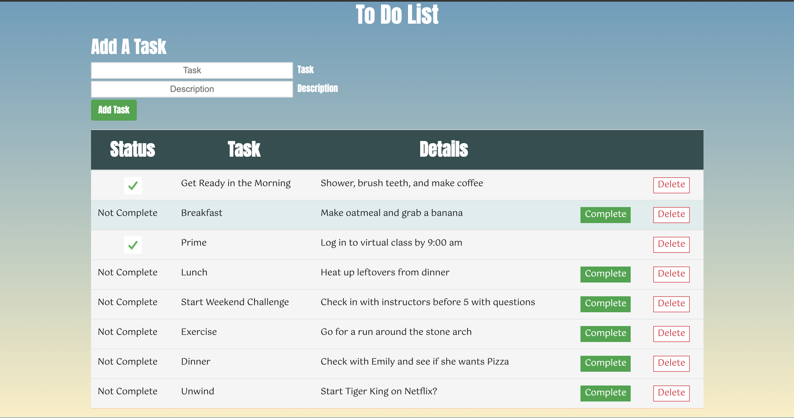

# SQL To Do List

## Description

_Duration: 3 Days_

This project was to create a to do list application to track tasks. The purpose was to gain a better underatanding of HTML, CSS, how to set up a server and link to a database, and create database queries from the client side.

To see the fully functional site, please visit: [DEPLOYED VERSION OF APP](https://weekend-sql-todolist.herokuapp.com/)

## Screen Shot

### Prerequisites

Link to software that is required to install the app (e.g. node).

- [Node.js](https://nodejs.org/en/)
- [Postico](https://eggerapps.at/postico/)

## Installation

1. Create a database named `weekend-to-do-app`,
2. The queries in the `database.sql` file are set up to create all the necessary tables and populate the needed data to allow the application to run correctly. The project is built on [Postgres](https://www.postgresql.org/download/), so you will need to make sure to have that installed. We recommend using Postico to run those queries as that was used to create the queries, 
3. Open up your editor of choice and run an `npm install`
4. Run `npm start` in your terminal.
5. Open a browser and type `localhost:5000` to use the program. (Note: any browser will work, but Chrome was used for development of this program)

## Usage

1. The database is initially populated with tasks from the included sql queries.
2. To add a task provide a name and brief description and click the `Add Task` button. The new task will appear at the bottom of the list.
3. When a task is finished, click the `Complete` button next to the task and it will be checked off the list.
4. To remove a task from the list click the `Delete` button. A window will open requesting confirmation. Click the `Delete` button to confirm or `Cancel` to go back to the list. (Note: a delete can't be undone)

## Built With

1. HTML
2. CSS
3. Bootstrap
4. jQuery

## Acknowledgement
Thanks to [Prime Digital Academy](www.primeacademy.io) who equipped and helped me to make this application a reality. Thanks to all my cohort for helping me develop the skills to build this application and helping me when I felt stuck.

## Support
If you have suggestions or issues, please email me at [zbattaglia3@gmail.com](www.google.com)
